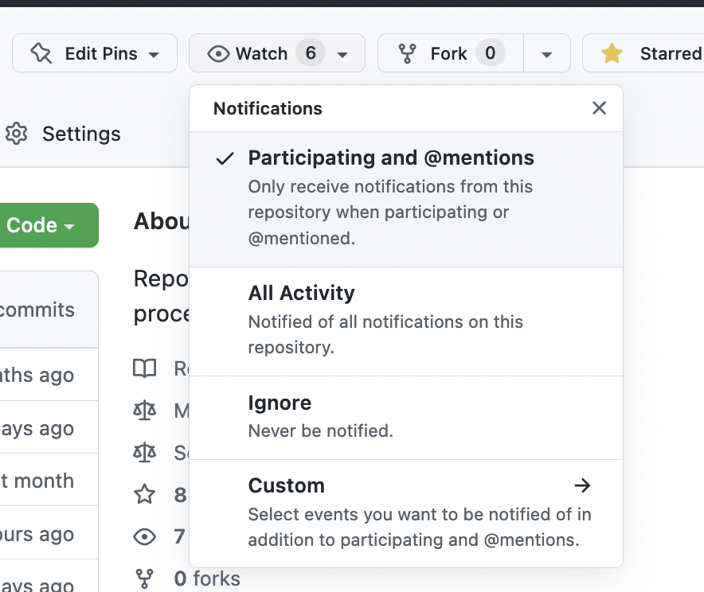
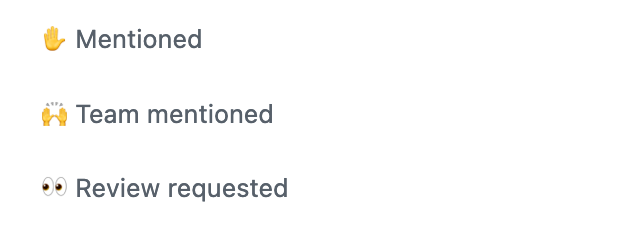

# Asynchronous communication standards

Here are the communication standards required for the Engine team to work asynchronously smoothly with their Meili colleagues.

## General requirements

- The engine team is expected to be available and reactive on GitHub and Slack. Since Meilisearch is a remote company, we prioritize asynchronous communication: you don't have to be available NOW, but you have to check your notifications multiple times a day.
- Answer your colleagues on Slack in 4-5h maximum. A question asked in the morning should be answered in the afternoon; a question asked in the afternoon should be your priority the next morning.
- If your colleague requires an action from you, answering them does not necessarily mean you have already done the action → it's ok to answer "I'll do it tomorrow."

🕑 **"I'll do it later" rule**

- Let your colleague know when it's done.
- If you are late for the job you are expected to do, but you engaged on a deadline, inform your colleague about your delay.
- In the best world, your colleague doesn't have to chase after you to get an answer.

🌴 **Holiday**

When you come back from Holiday, you are expected to catch your notifications. It's expected to be long (will probably take a full day only doing this). At least, after a long period of Holiday, you have to carefully watch: GitHub, and #general, mentions on Slack.

You are not expected to watch GitHub and Slack during Holiday so that your colleagues can ping you without disturbing your off-time.

## Slack

Meili company has an internal Slack. Here are the requirements regarding the Slack presence.

### Which channels to follow?

Watch **every single** message in

- #team-engine ⭐
- #general ⭐
- Mentions: `Thread` messages you are involved in (at the top of your Slack) ⭐
- Product squad channels you are involved in ⭐
- #discussion-opensource
- #help
- #discussion-dev
- #discussion-product
- #cloud-core-sync
- Private messages people send to you

⭐ = the most critical channels, don't finish your day without checking them.

### What's expected?

"Watch for messages" means

- Carefully read them
- If the message requires your answer, answer as soon as you can. (Cf above, it can be "I'll do it tomorrow").
- If the message requires the help or the intervention of one of your teammates, ping them.

💡 If the message has a "for your information" purpose, you can notify the person you read it by an explicit emoji under the message (👀 for instance).

⚠️ On Slack, one notification can hide multiple messages in the same channel: ensure you have read all the messages.

## GitHub

### What to follow?

Each member of the engine team is expected to follow every repository of the organization as "Participating and mentioned". This option means you will only receive GitHub notifications when you (or your team) are mentioned on a PR/issue.

Depending on your job and your seniority, it's also recommended to watch some repositories (like [Meilisearch](https://github.com/meilisearch/meilisearch) or [Product](https://github.com/meilisearch/product)) with "All Activity".

For isntance, the tech lead and the manager of the engine team are expected to follow "All Activity" of all the engine team repositories.

### What's expected?

- Read carefully every single notification when you are mentioned or asked for a review (i.e. pinged).
- Don't wait for too long to answer, a maximum of 72h, or
    - Let the colleague who pinged you know it's on your TODO
    - Ask for help if you really don't have the time to answer/review

⚠️ Be careful with the merged PRs and closed issues: some people ask for questions in them after the merge/closing.

💬 Even if you are not pinged, you are welcome to answer the PRs/issues, for instance, to help with the support. However, once you have started the conversation with the users, you are responsible for keeping to answer quickly (refer to the guide on [How to communicate with the contributors](https://www.notion.so/08528853c91d4049963087a9286f69f9) *internal link*). If you want to stop the support because of lack of time, ask the support team explicitly to continue the conversation for you.

💡 Use the filters in your GitHub notifications (on the left). The most important ones to check are:

## More tips

- Choose strategic moments to check your notifications: the beginning of the day, after lunch, and before leaving are common moments to check them. 
Depending on your job, it should be more often, but ensure you don't check them in the middle of a deep focus moment.
- If you leave your day without checking your notifications, ensure this is your priority the next day.
- GitHub notifications are presented as a list from the most recent to the oldest one: ensure you unstack the last one first, so the oldest ones.
- Use a personal TODO to ensure you don't forget to answer your colleagues on time.
