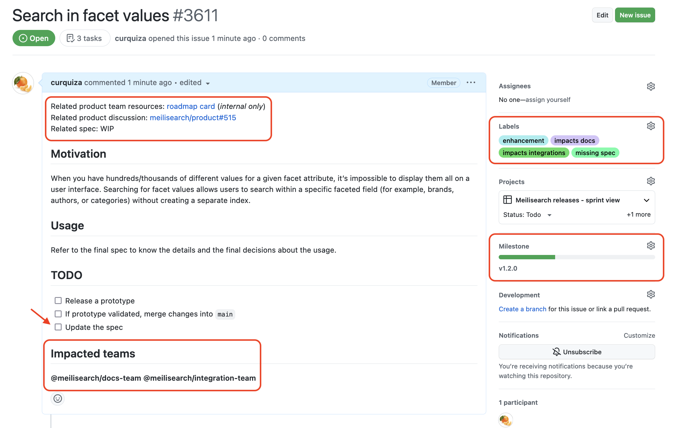

# Delivery & synchronization policy

The Engine team builds the search engine, which is itself used by the other teams in their scope: Integration, Docs, and Cloud teams.

> 👉 The Engine team is responsible for ensuring good and smooth communication about their work: the other teams must be able to easily understand and anticipate what will be integrated into the new Meilisearch release.

Here are some steps the Engine team must follow to ensure smooth management of the project.

## 📚 TOC

- [Before the sprint](#-before-the-sprint)
- [During the sprint/pre-release](#-during-the-sprint-and-pre-release)
- [Patch releases](#-patch-releases)
- [Label usage](#-label-usage)
- [Bad practices](#-bad-practices)

## 🌚 Before the sprint

### 1. Create a GitHub Milestone

The manager is responsible for creating the [GitHub Milestone](https://github.com/meilisearch/meilisearch/milestones) associated with the coming release.

Automation will be triggered by the Milestone’s creation and will open the [central roadmap issue](https://github.com/meilisearch/engine-team/blob/main/issue-templates/roadmap-issue.md). The manager must update this issue with the correct dates of the release.

### 2. Create the issues

An issue, or a global issue, must be opened for each user-experience change (even relevancy change). They can be opened by the manager or the developers working on them.

Each issue must contain

- The link(s) to the product resource(s) (PRD and [roadmap cards](https://www.notion.so/ef7d86c80ef44c549e2361c70a367723))
- The link to the related product discussions.
- The link of the related specification.
If a specification is planned but not ready yet (which is often the case), let an empty field you will update later.
- The motivation and the context of the issue.
Help other teams to understand the motivation for this change, so the “why” of the whole work. It does not have to be huge, but it should be relevant.
The most efficient way is to copy/past the information in the PRD or [product roadmap](https://www.notion.so/ef7d86c80ef44c549e2361c70a367723) card.
- Describe the steps in a `TODO` section: is a prototype needed? Updating the spec? Bump the charabia version?
- Ping impacted teams: the engine team manager is here to guide you with this choice.
- The appropriate labels
    - mandatory ones are `missing spec` `impacts XXX`
    - any additional labels for the context, see [this section](https://www.notion.so/Delivery-synchronization-policy-b4ec15c3e56a49539fa02d2f1d381de3).
- The appropriate [GitHub Milestone](https://github.com/meilisearch/meilisearch/milestones)

> 💡 If a user has already opened the issue first, update the issue description with the required information below, like this [one](https://github.com/meilisearch/meilisearch/issues/3572).

📺 **Example**

Quickly created thanks to the [related product roadmap card](https://www.notion.so/Customize-Text-Separators-36d7f85c7eee465e950f92427e791738).

> 💻 The `TODO` section is the developer space. Feel free to update it with as many technical steps as you need to organize your work.
Don’t forget to include the product steps (like updating the specs).

### 3. Validate the sprint content

The manager:

- ensures all the issues (bugs and product improvements) are present in the [GitHub Milestones](https://github.com/meilisearch/meilisearch/milestones). This Milestone must be **the exhaustive list** of the changes present in the coming release.
- according to the product team priorities, adds the product-oriented issues into the [GitHub sprint view](https://github.com/orgs/meilisearch/projects/24/views/5) to make the priority of the sprint clear.
This prioritization is shared with the engine team and reminded regularly.

### 4. Communicate the content with other teams

At the beginning of the sprint (and the pre-release), the engine team manager meets the managers of the integration, cloud, and docs teams to present the sprint content.

During this meeting, the manager

- browses each issue in the [Milestone](https://github.com/meilisearch/meilisearch/milestones): this way, they ensure the right teams are pinged and the issues are correctly labeled. This is an opportunity to remind the motivations of each feature implementation.
- shares the [sprint view](https://github.com/orgs/meilisearch/projects/24/views/5) to make other teams understand which features are more likely to be delayed.

> ⚠️ The managers of the other teams will use the issues in the Milestones to prepare their own work: that’s why the issues should contain all the needed links and information since they are the central reference for them.

## 🌝 During the sprint and pre-release

### PRs

- When opening a PR impacting the user experience or fixing a bug, **ensure the PR is well linked to a clear issue** → this will be helpful for the changelog writing.
Multiple PRs can be linked to one issue.
- Bonus: you can put labels on PRs (except `impacts XXX`); it will help us refine them in the future, but nothing is mandatory in our process so far.

### Issues

- All along the sprint, update the issues by commenting with the following information:
    - Any new decision related to the product
    - Any difficulties that might lead to delay in the feature
    - Once ready, add the missing spec link to the issue description and remove the `missing spec` label
    - Any prototype release: add a welcoming comment to test it and the `prototype available` label.
- When encountering any bugs we will have to fix in the coming release: open an issue, and add the associated Milestones.

>⚠️ During pre-release, when fixing a bug for the next RC, specify in the issue if the bug has been introduced during this sprint or was already present in the previous stable release.

### Changelogs

At the end of the sprint, the manager is responsible for writing release changelogs: that’s why the PRs should be linked to issues, and the issues must redirect to all the necessary resources.

All along the pre-release, these changelogs must be updated with last-minute changes and bug fixes (present before the sprint)

### Roadmap issue

The manager is responsible for updating the central roadmap issue (like [this one](https://github.com/meilisearch/meilisearch/issues/3557)) and ensuring the step are moving forward.

### RCs and releases

The manager is responsible ƒor informing the other teams on our internal Slack (#ms-release) for each new release **once all the binaries and images are published**.

If there is any issue with the CIs, the other teams (support included) should be informed.

When releasing RC0, the manager and the PM are responsible for communicating with the community through issues and product discussions. The goal is to have the maximum number of users testing the RC.

> 📚 All the steps that should be done to release the new version of Meilisearch (RCs and official releases) are detailed in [this guide](https://github.com/meilisearch/engine-team/blob/main/resources/meilisearch-release.md).

### Last minute changes

Especially during the pre-release, any last-minute changes regarding the usage of Meilisearch should lead to

- a comment on the related issue by pinging the involved teams
- a message in our internal Slack to let people know about the change

## 🩹 Patch releases

When doing a patch release, the manager is responsible for

- informing immediately in our internal Slack a patch release is coming and when it’s planned
- opening a new [GitHub Milestone](https://github.com/meilisearch/meilisearch/milestones)
- following the steps in [this guide](https://github.com/meilisearch/engine-team/blob/main/resources/meilisearch-release.md#how-to-do-patched-release-following-hotfixes) to make the release concrete
- once the release is done
    - Informing the users on the related issue(s) the new release containing the fix is available
    - Informing people on our internal Slack the patch release is done available

## 🔖 Label usage

This is not an exhaustive list of all the labels, but the most important ones.

### Communicate with other Meili teams

- `impacts integration`, `impacts docs`, `impacts cloud`, `impacts mini-dashboard`: let the other teams know the issue impacts their scope
⚠️ This label should only be put on issues, not PRs. Indeed, it’s not convenient for other teams to come and try to understand what’s happening in technical PRs.
- `support`: let the support team know we need them to answer the users.
Something that looks like a bug can be considered as `support` until the support reproduces it on the latest version and officially reports it as a bug.
- `feature request`: this label is to categorize an issue as a feature request. We don’t accept feature requests on the Meilisearch repository.
However, it often happens users think some behaviors are bugs, but in fact, they are missing features in the engine. In this case, we label the issue as `feature request` and redirect the users to the [product repository](https://github.com/meilisearch/product/discussions).
Can be useful for the Product team.
- `missing spec`: updating the specification is part of the issue solving but is not done yet.

### Interact with the community/users

- `good first issue`, `contribution accepted`, `help wanted`: these are labels to call the community for help (discussion or direct contribution into the code base).
Do NOT put `good first issue` if the issue is not easy, only let `contribution accepted`.
- `needs more info`: this issue needs more information to be solved. Often used for bugs.
- `prototype available`:

### Classify issue

- Basic classification related to the Milisearch usage: `enhancement`/`bug`
A bug is a behavior that is not expected to be present.
An enhancement is any addition or improvement in the Meilisearch usage.
- `documentation`: related to the engine team documentation (not the [official Meili docs](https://docs.meilisearch.com/)). For instance, any change on the README, CONTRIBUTING, comments in the code base…
- `maintenance`: related to any internal change (refactoring, CI, tests…)
- `tools`: related to any “tools” the engine team maintains, like the Docker image
- `technical discussion`: nothing to solve, only an open technical discussion. It can be a good opportunity to discuss with the community.
- `tracking issue`: when you create a central issue gather multiple sub-issues.

### For us

We also have a wide variety of labels you are free to change and add more.

- Related to the scope: `milli`, `tokenizer`...
- Related to the topics: `error handler`, `relevancy`, `performance`, `language`, `CPU/RAM usage`, `lmdb`...
- Related to the platform: `macOS`, `windows`…
- Related to the changelogs: `breaking change` and `skip changelogs`

## ❌ Bad practices

Here is some practices we want to avoid after having made the mistake in the past.

**Do NOT ping another team in a PR**

PRs are inconvenient for discussing or informing about user-experience changes, even last-minute/small changes. The information can be lost in tons of technical discussions.

Same, no need to add the label `impacts XXX` on PRs since other teams are not expected to follow them.

✅ Open an issue instead, ping them, and add the appropriate labels (`impact XXX`) on it.

**Do NOT open an issue with the `feature request` label**

The `feature request` label exists but is here to tag the issues opened by contributors who used the wrong path (thinking first is a bug, but actually, the feature is not present in the search engine)

✅ Use the **product repository instead** to suggest a new feature in the search engine. Or discuss it with the product team first.

**Do NOT inform the other teams the release is done before all the binaries and images are published**

Inform them once all the CIs have finished running.

✅ It’s possible to let the engine team know the CIs are running, but they must know they should not communicate about it.
