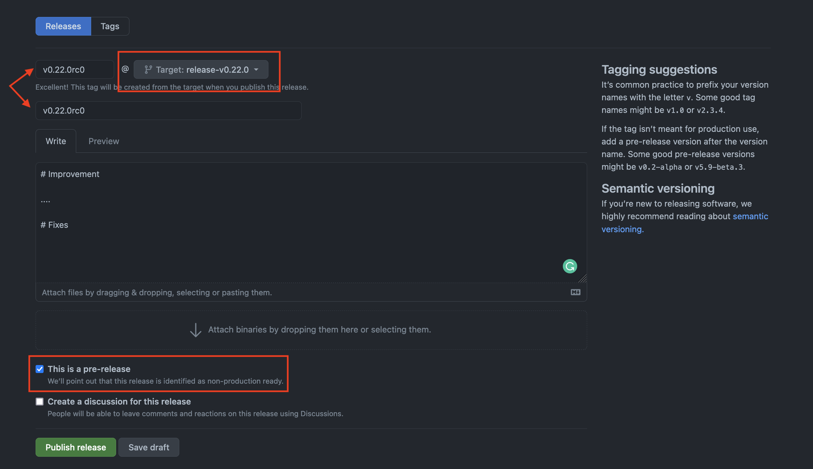
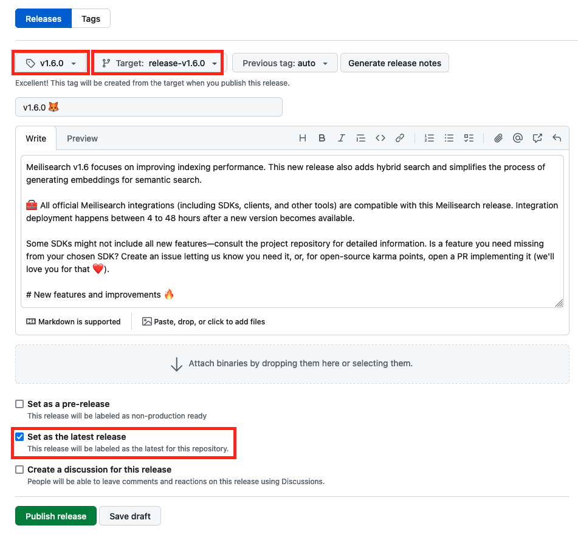
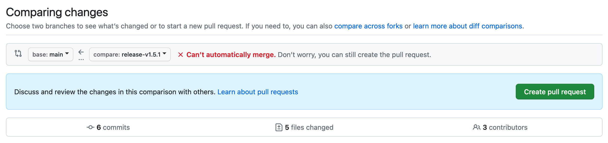

# Meilisearch release process

This guide is to describe how to make releases and pre-releases for the [Meilisearch repository](https://github.com/meilisearch/meilisearch).

At the beginning of the pre-release phase, the first RC is released. Other RCs will be done if bugs are found.

At the end of the pre-release phase, the official release is published.

> 📚 More information about the sprint organization and the different sprint phases in this [guide](./sprint-organization.md).

## 🏋️‍♂️ Meilisearch pre-release phase

### How to create the first pre-release (or RC i.e. Release Candidate)

In the Meilisearch repository:

1. Ensure:
- the version of Meilisearch in the `Cargo.toml` files has been updated. Use [our automation](https://github.com/meilisearch/meilisearch/actions/workflows/update-cargo-toml-version.yml) if not -> click on `Run workflow`, and fill the appropriate version before validating. A PR updating all the versions in the `Cargo.toml` files will be created.
- A [GitHub Milestone](https://github.com/meilisearch/meilisearch/milestones) has been opened for this new version.

2. Make sure you are on the `main` branch and pull the last commits:

```bash
git checkout main
git pull origin main
```

3. Create a release branch named `release-vX.Y.Z` where `X.X.X` is the new version and push this branch

```bash
git checkout -b release-vX.Y.Z
git push -u origin release-vX.Y.Z
```

4. Copy/paste this TODO steps on your side
<details>
<summary>RC todo</summary>
- [ ] Launch RC on the GitHub interface</br>
- [ ] Adapt changelog in the <a href=https://github.com/meilisearch/engine-team/pulls>related PR</a>: make a commit suggestion, or, if too big, open a PR.</br>
- [ ] Check binaries and Docker images are ready: check the assets are attached to the release + run the Docker image on your machine to ensure it starts correctly (at least)</br>
- [ ] Manually run <a href=https://github.com/meilisearch/meilisearch/actions/workflows/sdks-tests.yml>SDK tests</a> with the new RC, and ensure the failing tests are expected</br>
- [ ] Make a message on #ms-release to announce the new RC: highlight the new changes if impactful for other teams, and link the link of the release.</br>
</details>

6. Go to the GitHub interface, in the [`Release` section](https://github.com/meilisearch/meilisearch/releases).

7. Click on the `Draft a new release` button

8. Fill the form with:
- the title of the release: `vX.Y.Z-rc.0`
- the tag associated to the release: should be `vX.Y.Z-rc.0`
- ⚠️ the branch on which to push the tag: `release-vX.Y.Z`. Do not push the tag to `main`!
- the description: add as many details as possible: the PRs, the authors, the new usage, the external contributors we want to thank...
- ⚠️⚠️ the `This is a pre-release` check box



8. Finally, when you are sure, click on the `Publish release` button.

⚙️ The CIs will be triggered to:
- upload binaries to the associated GitHub pre-release.
- publish the associated Docker image (`vX.Y.Z`) to DockerHub.

9. Ensure you made all steps in the TODO you copied/pasted at step 4.

### What if some bugs are in the RC?

1. Create a new branch starting from the branch `release-vX.Y.Z` and commit on this new branch.

2. Open and merge the PR originating this new branch and pointing to `release-vX.Y.Z`

### How to release the next RCs

When all/enough hotfixes have been done to the `release-vX.Y.Z` branch, create a new RC.
The steps are the same as for `How to create the first pre-release (or RC i.e. Release Candidate)` but starting from step 4 and with the new RC name.

## 🔥 Meilisearch official release

### How to do the official release

1. Copy/paste this TODO steps on your side
<details>
<summary>Release todo</summary>
- [ ] Launch the release on the GitHub interface</br>
- [ ] Check binaries and Docker images are ready: check the assets are attached to the release + run the Docker image on your machine to ensure it starts correctly (at least)</br>
- [ ] Check the <a href="https://github.com/Homebrew/homebrew-core/pulls">Homebrew PR</a> has been created.</br>
- [ ] Once everything is deployed, make a message on #ms-release to announce the new release: ping integration-team and docs-team since they should deploy their own scope now.</br>
- [ ] Bring back commits on the `release-vX.Y.Z` into `main` (cf <a href="https://github.com/meilisearch/engine-team/blob/main/resources/meilisearch-release.md#after-the-release-bring-back-changes-to-main">this section</a>)</br>
</details>

2. Go to the GitHub interface, in the [`Release` section](https://github.com/meilisearch/meilisearch/releases).

3. Click on the `Draft a new release` button

4. Fill the form with:
- The title of the release: `vX.Y.Z`
- The tag associated to the release: should be `vX.Y.Z`
- ⚠️ The branch on which to push the release: `release-vX.Y.Z`. Do not push the tag to `main`!
- The description: use the changelogs in [the related PR](https://github.com/meilisearch/engine-team/pulls). ⚠️ Some lines of the changelogs must be removed; check carefully the comments and if there is any remaining `TBD`.
- Check the `Set as the latest release`



5. Finally, when you are sure, click on the `Publish release` button.

⚙️ The CIs will be triggered to:
- [Upload binaries](https://github.com/meilisearch/meilisearch/actions/workflows/publish-binaries.yml) to the associated GitHub release.
- [Publish the Docker images](https://github.com/meilisearch/meilisearch/actions/workflows/publish-docker-images.yml) (`latest`, `vX.Y` and `vX.Y.Z`) to DockerHub -> check the "Docker meta" steps in the CI to check the right tags are created
- [Publish binaries for Homebrew and APT](https://github.com/meilisearch/meilisearch/actions/workflows/publish-apt-brew-pkg.yml)
- [Move the `latest` git tag to the release commit](https://github.com/meilisearch/meilisearch/actions/workflows/latest-git-tag.yml).

6. Ensure you complete all the TODO tasks you copied/pasted at step 1.

### After the release: bring back changes to `main`

Some commits might miss to `main` since the engine-team did some hotfixes merged to the `release-vX.Y.Z` branch.

In this case, you need to bring them back from `release-vX.Y.Z` to `main` by creating and merging a PR originating `release-vX.Y.Z` and pointing to `main`.

⚠️ If you encounter any git conflicts when creating the PR, please do NOT fix the git conflicts directly on the `release-vX.Y.Z` branch. It would bring the changes present in `main` into `release-vX.Y.Z`, which would break a potential future patched release.



Instead:
- Create a new branch originating `release-vX.Y.Z`, like `tmp-release-vX.Y.Z`
- Create a PR from the `tmp-release-vX.Y.Z` branch and pointing to `main`
- Fix the git conflicts on this new branch
    - By either fixing the git conflict via the GitHub interface
    - By pulling the `main` branch into `temp-release-vX.Y.Z` and fixing them on your machine.
- Merge this new PR into `main`

### How to do patched release (following hotfixes)

It happens some releases come with impactful bugs in production (e.g. indexation or search issues): we obviously don't wait for the next cycle to fix them and we release a patched version of Meilisearch.

1. Create a new release branch starting from the latest stable Meilisearch release (`latest` or `release-vX.Y.Z`).

```bash
# Ensure you get all the current tags of the repository
git fetch origin --tags --force

# Create the branch
git checkout latest
git checkout -b release-vX.Y.Z
git push -u origin release-vX.Y.Z
```

2. Open a [new GitHub Milestone `vX.Y.Z`](https://github.com/meilisearch/meilisearch/milestones) related to this new version.

3. Change the [version in `Cargo.toml` file](https://github.com/meilisearch/meilisearch/blob/e9b62aacb38f2c7a777adfda55293d407e0d6254/Cargo.toml#L21). You can use [our automation](https://github.com/meilisearch/meilisearch/actions/workflows/update-cargo-toml-version.yml) -> click on `Run workflow` -> Fill the appropriate version and run it on the newly created branch `release-vX.Y.Z` -> Click on "Run workflow". A PR updating the version in the `Cargo.toml` and `Cargo.lock` files will be created.

4. Open and merge the PRs (fixing your bugs): they should point to `release-vX.Y.Z` branch.

5. Follow all the steps in the ["How to do the official release" section](#how-to-do-the-official-release) with the patched version name.

6. Same as the official release, if needed, bring the new commits back from `release-vX.Y.Z` to `main` by merging a PR originating `release-vX.Y.Z` and pointing to `main`.

⚠️ <ins>If doing a patch release that should NOT be the `latest` release</s>:

- Do NOT check `Set as the latest release` when creating the GitHub release. If you did, quickly interrupt all CIs and delete the GitHub release!
- Once the release is created, you don't have to care about Homebrew, APT and Docker CIs: they will not consider this new release as the latest; the CIs are already adapted for this situation.
- However, the [CI updating the `latest` git tag](https://github.com/meilisearch/meilisearch/actions/workflows/latest-git-tag.yml) is not working for this situation currently and will attach the `latest` git tag to the just-created release, which is something we don't want! If you don't succeed in stopping the CI on time, don't worry, you just have to re-run the [old CI](https://github.com/meilisearch/meilisearch/actions/workflows/latest-git-tag.yml) corresponding to the real latest release, and the `latest` git tag will be attached back to the right commit.

## 🎈 Other library release process

The release process of other repositories maintained by the engine team is described in the corresponding CONTRIBUTING.md of each repository.
